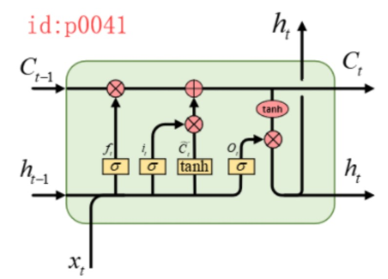
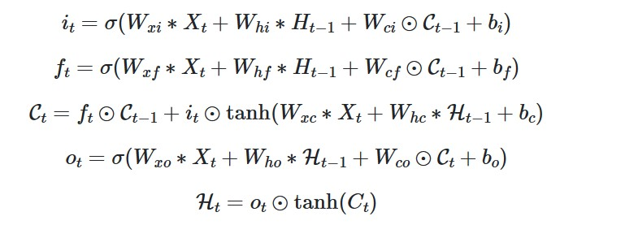
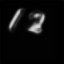
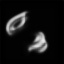

# Convlstm(Moving-Minist-dataset)

## Abstract:

This repository is my little  outcome after reading the paper.

The paper's url is:https://paperswithcode.com/paper/convolutional-lstm-network-a-machine-learning. 

The convlstm model structure is :






## Other assistance:

### 1、Dataset:

To test my understanding of the model,I try to write the code using Moving Minist dataset.
The dataset can be download from https://www.cs.toronto.edu/~nitish/unsupervised_video/

If you don't want to build the dataset loader by yourself , you can find the interface here

[tychovdo/MovingMNIST: Moving MNIST as PyTorch Dataset (github.com)](https://github.com/tychovdo/MovingMNIST)

### 2、Official_Model

The relevant official model I learned can be found from two urls：
convlstm:https://github.com/ndrplz/ConvLSTM_pytorch
seq2seq:https://github.com/holmdk/Video-Prediction-using-PyTorch

### 3、Environment

```
pytorch ：1.8.0
cv2 : 4.7.0
numpy:1.21.5
matplotlib 3.2.2
```


## How to use:

```
-- Convlstm(Moving-Minist-dataset)
	-main.py # run python main.py to train the model 
	-my_model.py #convlstmcell,convlstm and encoder-forcasting model
	-convlstm.py #official model ,use to look error
	-MovingMNIST.py #generate the dateload
	-download.py #unzip the dataset if necessary
```


### 1、download the dataset from the web (See Dataset part)

```python
'''
If download from the web is not successful ,you can download the mnist_test_seq.npy into the ./raw file
open the MovingMNIST.py and find the following code. This part is used to  download from the web automatically. Comment out this part to bypass the download.
'''


'''
        for url in self.urls:
            print('Downloading ' + url)
            data = urllib.request.urlopen(url)
            filename = url.rpartition('/')[2]
            file_path = os.path.join(self.root, self.raw_folder, filename)
            with open(file_path, 'wb') as f:
                f.write(data.read())
            with open(file_path.replace('.gz', ''), 'wb') as out_f, \
                    gzip.GzipFile(file_path) as zip_f:
                out_f.write(zip_f.read())
            os.unlink(file_path)
        '''
```


### 2、run the main.py

```
python main.py
```

## Results:

We input 10 photos as a sequence and get 10 predicted_pictures.

After the experiment , we found that the more epoches you train,the more better results  you could get . And this model now is good but not perfect. The first few pictures are clear but the last few pictures are blurry . Here we only show first few pictures.

### Loss-epoches photo:


### Predicted-Moving Number:(run 100 epoch)







